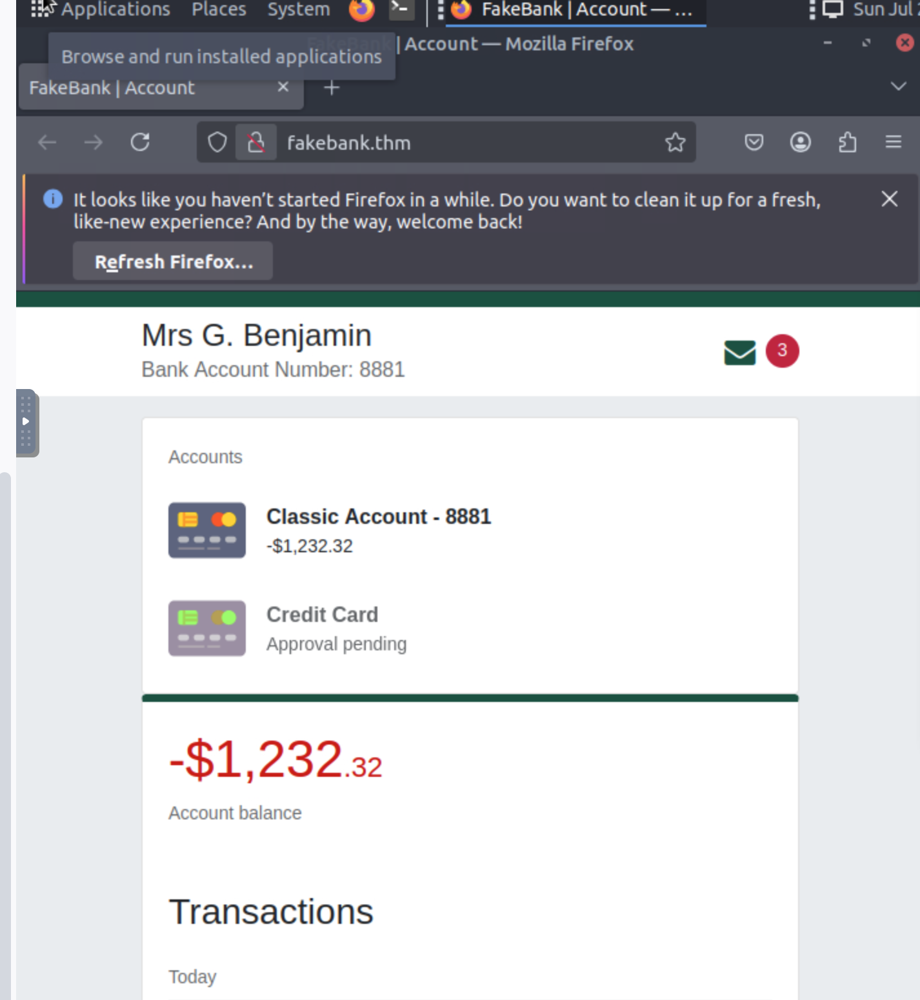
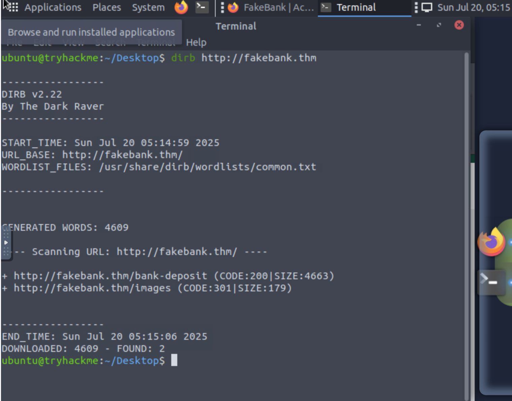

## Room Completed: Offensive Security Intro

📅 **Date:** 2025-07-13

---

## ✅ Key Concepts

- Offensive Security represents the process where you simulate a hacker's actions to find vulnerabilities in a system.
- Red teams and penetration testers specialize in offensice security.

- What does it involve?
  - breaking into computer systems
  - exploiting software bugs
  - finding loopholes in applications to gain unauthorized access

- Tool used: Bash shell
  - `dirb` command: it uses a brute-force approach to find a list of potential hidden URLs associated with web pages.

---

## 🧪 Lab Completed: Using dirb To Find Hidden Website Pages

  

🔍 **Observation:**  
The purpose of this lab was to hack a bank and inflate our bank account balance. Running `dirb http://fakebank.thm` in the terminal
revealed a hidden URL `http://fakebank.thm/bank-deposit` that I was able to access and inflate the balance of my account # 8881.

---

## 🛡️ Why This Matters for SOC Analysts

- Helps detect reconnaissance activity like brute-force attacks.
- SOC analysts can monitor logs for unusual URL requests or high 404 rates.
- Supports early threat detection and helps fine-tune SIEM alerts or WAF rules.
