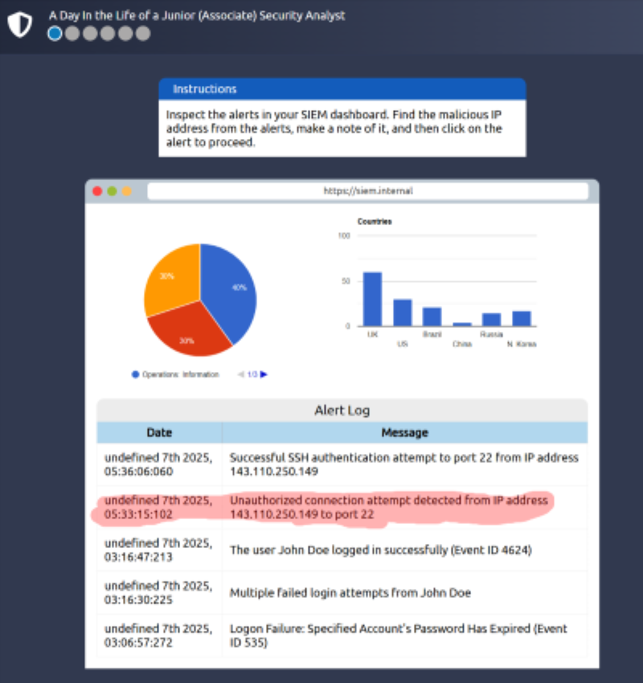
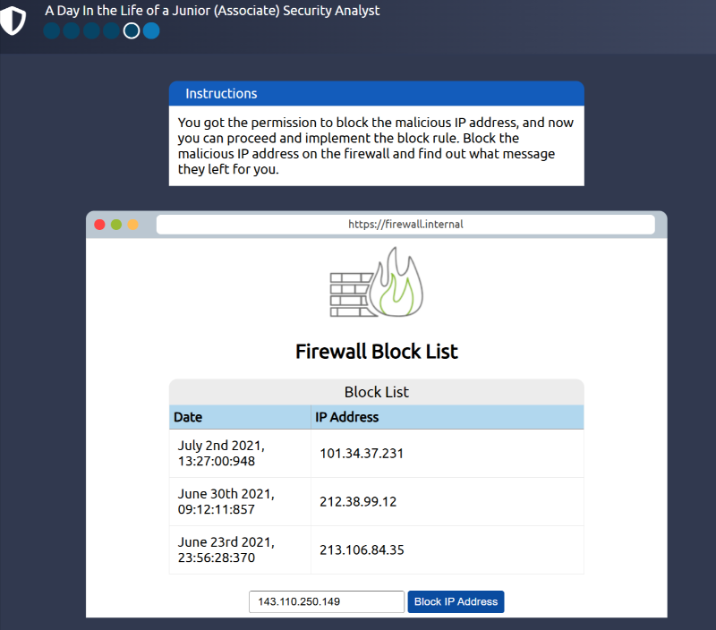

## Room Completed: Defensive Security Intro

📅 **Date:** 2025-07-14

---

## ✅ Key Concepts

- Defensive security is concerned with two main tasks:
  - Preventing intrusions from occuring
  - Detecting intrusions when they occur and responding properly

- Blue teams are part of the defensive security landscape
  - Some tasks associated with this function include:
    - user awareness of cyber threats, documenting & managing assets, updating & patching systems
    - setting up preventative security, logging & monitoring devices

- Activities and functions of blue teams
  - Security Operations center, threat intelligence
  - Digital Forensics & Incident Response (DFIR), malware analysis

---

## 🧪 Lab Completed: Simulating a SIEM

  
  

🔍 **Observation:**  
An unauthorized connection was detected. I escalated it to the SOC team leader who gave me permission to block the IP address which
I did in the firewall. 

---

## 🛡️ Why This Matters for SOC Analysts

- Enhances threat detection skills using SIEM tools to identify suspicious activity.
- Builds experience in escalation and incident response workflows, such as blocking malicious IPs.
- Reflects real-world SOC duties, including monitoring, triage, and communication within a security team.
