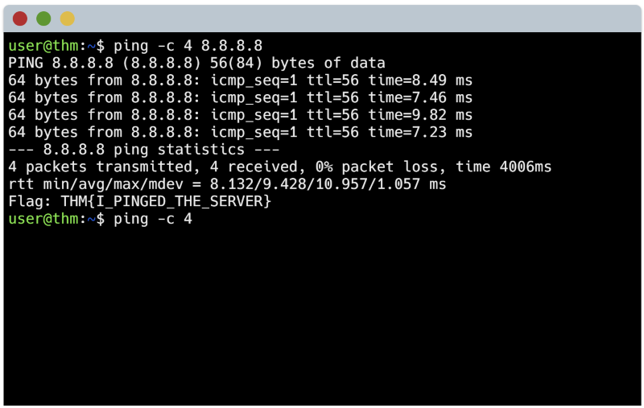

## Room completed: What is networking?

Date: 7/16/25

### ◦ What I learned:  

- A computer network can be formed by 2 or more devices. It can be one of two types: A private or public network. 
Devices identify using IP addresses (Internet Protocol) and MAC (Media Access Control) addresses. 
IPv4 looks like `192.168.1.1`  and IPv6 looks something like `2001:0db8:85a3:0000:0000:8a2e:0370:7334`. IPv4 is limited to 4.29 billion. 
IPv6 (340 trillion plus). MAC address is unique to each device and looks to something like `a4:c3:f0:85:ac:2d` where the first 
six characters represent the network interface manufacturer, and the last six represent its unique address. MAC addresses can 
be spoofed. `Ping` uses ICMP (Internet Control Message Protocol) packets to determine the performance of a connection between 2 
devices, and if that connection exists.

## Lab completed: How to ping?

Pinging `8.8.8.8` informs us that we have sent 4 packets, all of which were received at an average of 9.428 seconds.
###  ◦ Why does this matter to SOC analysts?
- Understanding how computers connect and communicate is foundational for detecting anomalies in network traffic.  
- It helps analysts recognize normal vs. suspicious activity (e.g., unusual IP addresses, unexpected MAC addresses, spoofing).  
- Knowing how tools like ping and protocols like ICMP work enables SOC analysts to verify connectivity and troubleshoot network issues during incident response.
